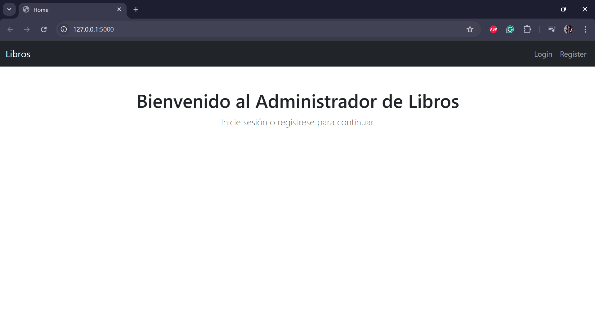
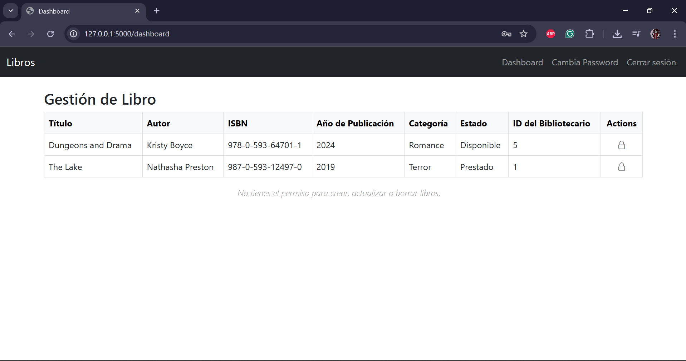

# Comp2052-Proyecto-Final: Caso 02-Gestor de Biblioteca

Este proyecto permite gestionar los libros de una Biblioteca donde **Bibliotecarios** pueden crear, editar y borrar libros, y los **Lectores** pueden visualizarlos. Además, los **administradores** pueden gestionar usuarios y roles. Es el Proyecto 2 dentro de una colección de 11 proyectos desarrollados como práctica final del curso Comp 2052.

A continuación, las imagenes de las interfaces de front-end del proyecto:
 
---

<figure class="image"> 
   <figcaption>Home Page / Dashboard </figcaption>
   
</figure>

---

<figure class="image">
   <figcaption>Login Page</figcaption>
   
</figure>

---

<figure class="image"> 
   <figcaption>Register Page</figcaption>
   
</figure>

---

<figure class="image">
   <figcaption>Change Password Page </figcaption>
   
</figure>

---

<figure class="image">
   <figcaption>Password Changed Paged </figcaption>
   
</figure>

---

<figure class="image"> 
   <figcaption>Home Page / Dashboard (Bibliotecario) </figcaption>
   
</figure>

---

<figure class="image">
   <figcaption>Home Page / Dashboard (Lector) </figcaption>
   
</figure>

---

<figure class="image"> 
   <figcaption>Home Page / Dashboard (Administrador) </figcaption>
   
</figure>

---

<figure class="image">
   <figcaption>Add New Book Page </figcaption>
   
</figure>

---

<figure class="image">
   <figcaption>Dashboard with a new book</figcaption>
   
</figure>

---

<figure class="image">
   <figcaption> Dashboard deleting a book </figcaption>
   
</figure>

---

<figure class="image">
   <figcaption> Edit Book Page </figcaption>
   
</figure>

---

<figure class="image">
   <figcaption> Dashboard with an edited book </figcaption>
   
</figure>

---

<figure class="image">
   <figcaption>User list</figcaption>
   
</figure>

---

## 🚀 Tecnologías utilizadas

- **Flask** – Framework backend en Python
- **Flask-Login** – Sistema de autenticación
- **MySQL** – Base de datos relacional
- **SQLAlchemy** – ORM para la base de datos
- **Bootstrap 5** – Framework CSS responsivo
- **Jinja2** – Motor de plantillas para HTML

---

## 📂 Estructura del proyecto

| Archivo / Carpeta                                                 | Descripción                                                                |
| ----------------------------------------------------------------- | -------------------------------------------------------------------------- |
| `create_demo_users.py`                                            | Script para crear usuarios iniciales con roles y contraseñas               |
| `config.py`                                                       | Configuración de Flask (DB URI, claves, etc.)                              |
| `README.md`                                                       | Este archivo de documentación del proyecto                                 |
| `requirements.txt`                                                | Lista de paquetes Python requeridos                                        |
| **`run.py`**                                                      | Punto de entrada para ejecutar el servidor Flask                           |

| `app/__init__.py`                                                 | Inicializa la aplicación Flask y carga la configuración                    |
| `app/models.py`                                                   | Contiene los modelos SQLAlchemy: User, Role, Libro                         |
| `app/forms.py`                                                    | Formularios de Flask-WTF usados en login, registro, libro, contraseñas     |
| `app/routes.py`                                                   | Rutas principales del proyecto (dashboard, libro, cambiar contraseña)      |
| `app/auth_routes.py`                                              | Rutas para autenticación (login, registro, logout)                         |
| `app/templates/layout.html`                                       | Plantilla base HTML con barra de navegación                                |
| `app/templates/index.html`                                        | Página de inicio pública del sitio                                         |
| `app/templates/login.html`                                        | Formulario de login de usuario                                             |
| `app/templates/register.html`                                     | Formulario de registro con selección de rol                                |
| `app/templates/dashboard.html`                                    | Panel principal del usuario autenticado                                    |
| `app/templates/libro_form.html`                                   | Formulario de creación/edición de libros                                   |
| `app/templates/libros.html`                                       | Vista de los libros creados por el usuario                                 |
| `app/templates/usuarios.html`                                     | Listado de usuarios con sus roles (solo para admins)                       |
| `app/templates/cambiar_password.html`                             | Formulario para cambiar la contraseña del usuario                          |
| `static/css/styles.css`                                           | Archivo CSS personalizado (opcional)                                       |
| `database_schema/02_biblioteca.sql`                               | SQL para crear la base de datos y tablas del proyecto de cursos            |

---
