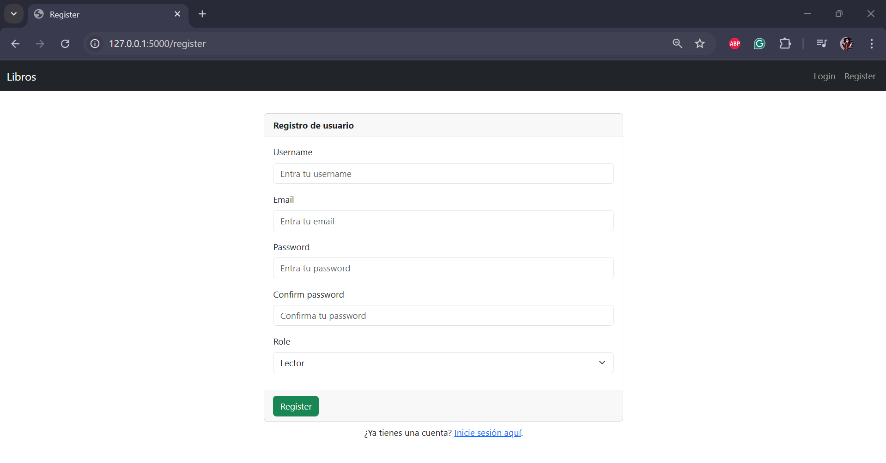
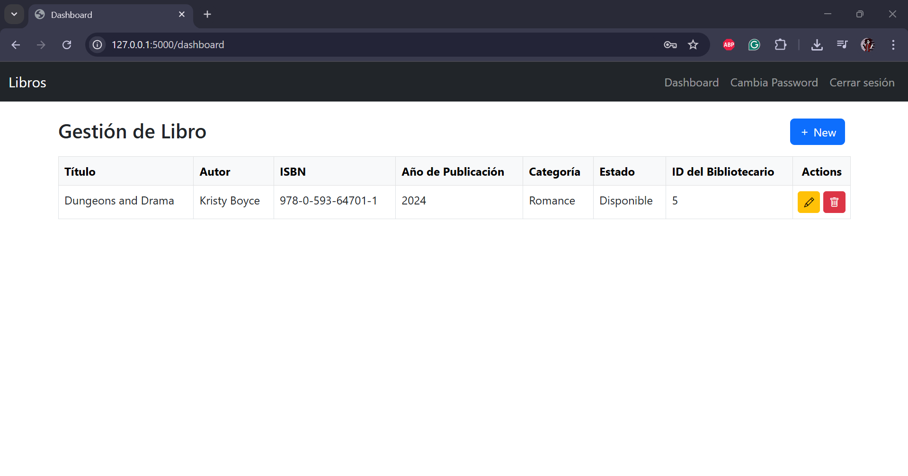
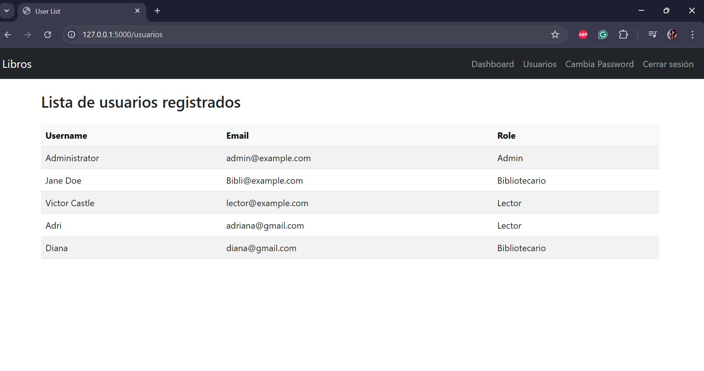

# Comp2052-Proyecto-Final: Caso 02-Gestor de Biblioteca

Este proyecto permite gestionar los libros de una Biblioteca donde **Bibliotecarios** pueden crear, editar y borrar libros, y los **Lectores** pueden visualizarlos. Además, los **administradores** pueden gestionar usuarios y roles. Es el Proyecto 2 dentro de una colección de 11 proyectos desarrollados como práctica final del curso Comp 2052.

A continuación, las imagenes de las interfaces de front-end del proyecto:

<figure class="image">
   
   <figcaption>Login Page</figcaption>
</figure>

<figure class="image">
   
   <figcaption>Register Page</figcaption>
</figure>

<figure class="image">
   
   <figcaption>Home Change Password Page </figcaption>
</figure>

<figure class="image">
   
   <figcaption>Home Page / Dashboard (Bibliotecario) </figcaption>
</figure>

<figure class="image">
   
   <figcaption>Home Page / Dashboard (Administrador) </figcaption>
</figure>

<figure class="image">
   
   <figcaption>Add New Book Page </figcaption>
</figure>

<figure class="image">
   
   <figcaption>Home Edit Book Page </figcaption>
</figure>

<figure class="image">
   
   <figcaption>User list</figcaption>
</figure>
